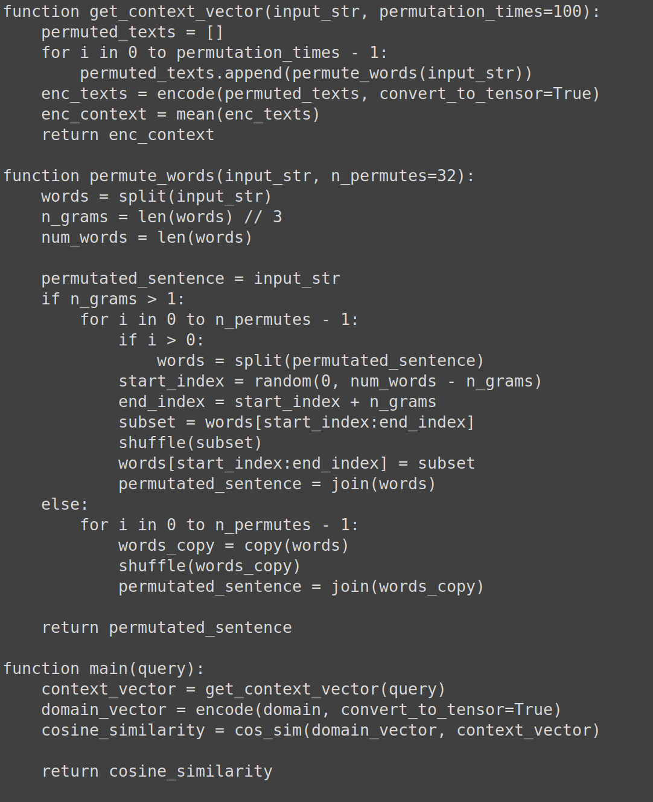

# Исследование уязвимостей в моделях машинного обучения
## Model Cards
* **Censor's model (обучена)** -> [Bi-Encoder](https://huggingface.co/DiTy/bi-encoder-russian-msmarco)
* **Model for retrieve (обучена)** -> [Cross-Encoder](https://huggingface.co/DiTy/cross-encoder-russian-msmarco)
* **LLM model (из коробки)** -> [Autoregressive decoder-only](https://huggingface.co/Intel/neural-chat-7b-v3-2)

## Цензор намерений

Реализация самого цензора находится тут [censor_app](./src/censor_app/)

Ниже представлен псевдокод реализации цензора:


## Start services

После пуллинга репозитория выполнить:
```sh
docker-compose up
```


